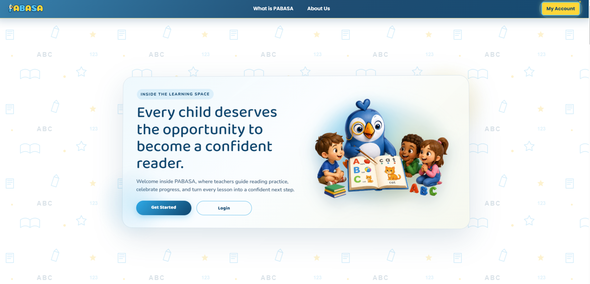

<div align="center">
  
  <h1>P.A.B.A.S.A</h1>
  <p><strong>Platform for Automated Basic Reading and Speech Assessment</strong></p>
  <p>Helping teachers guide every child toward confident reading.</p>
  <p>Reading assessment · Guided practice · Classroom management · Learner progress</p>
  <p>
    
    
    
    
    
    
    <a href="LICENSE"></a>
  </p>
  <p><a href="#overview">Overview</a> · <a href="#features">Features</a> · <a href="#quick-start">Quick start</a> · <a href="#configuration">Configuration</a> · <a href="#research-and-team">Research & team</a></p>
</div>



<p align="center"><em>Every child deserves the opportunity to become a confident reader.</em></p>

## Overview

PABASA is a web-based reading evaluation system developed for **Grade 2 students at Salawag Elementary School**, as a research project at **Technological University of the Philippines – Cavite**.

Teachers can organize classes, prepare learning materials, assess reading, and review learner progress in one place. Students take part in reading activities and guided practice, with speech recognition supporting automated assessment and feedback.

## Features

| Area | What you can do |
| --- | --- |
| Reading assessment | Record reading audio in the browser and use speech recognition to support evaluation. |
| Guided practice | Work through reading materials and activities such as syllable blending, sound detection, and story responses. |
| Classroom management | Manage classes, enrollment, courses, and assigned learning materials. |
| Learning materials | Prepare activities from uploaded documents and images, with PDF text extraction and OCR support. |
| Progress tracking | Review reading attempts, learner classifications, and progress reports. |
| CRLA reporting | Export Grade 2 Tagalog scoresheets and render workbook reports to PDF. |
| Teacher review | Review learner responses and use results to guide follow-up instruction. |

## Technology stack

PABASA uses server-rendered Django pages with JavaScript for interactive activities and browser audio recording.

| Layer | Technologies |
| --- | --- |
| Backend | Python 3.13, Django 6.0.3, Django ORM |
| Frontend | Django templates, HTML, CSS, JavaScript, Bootstrap, Bootstrap Icons |
| Charts and previews | Chart.js, PDF.js |
| Audio capture | MediaRecorder, Web Audio APIs |
| Database | SQLite |
| Speech recognition | Google Cloud Speech-to-Text |
| Documents and OCR | Tesseract, pytesseract, Pillow, pypdf, openpyxl, ReportLab, LibreOffice Calc |
| Deployment | Docker, Gunicorn, WhiteNoise |

## Quick start

Use **Python 3.13** to match the repository's Docker runtime, with `pip` and Git installed. Speech recognition, email delivery, OCR, and workbook rendering need the additional configuration below.

### 1. Clone the repository

```sh
git clone https://github.com/maeven-tapa/pabasa_workspace.git
cd pabasa_workspace
python -m venv .venv
```

Activate the virtual environment:

```powershell
# Windows PowerShell
.\.venv\Scripts\Activate.ps1
```

```sh
# macOS / Linux
source .venv/bin/activate
```

### 2. Install and initialize

```sh
python -m pip install -r requirements.txt
python pabasa_site/manage.py migrate
python pabasa_site/manage.py createsuperuser
python pabasa_site/manage.py runserver
```

### 3. Open PABASA

Open the [local homepage](http://127.0.0.1:8000/) to explore the website. The superuser account created above can access [Django administration](http://127.0.0.1:8000/admin/). Registration and other email-dependent flows require working SMTP configuration.

## Configuration

Django loads a `.env` file from the repository root. Create one for the credentials your local setup needs; keep credentials out of version control.

### Speech recognition

Configure the Google Cloud project, location, and model in `pabasa_site/pabasa_site/settings.py` for your deployment. The speech client supports a service-account file at `pabasa_site/google-stt-service-account.json`, or service-account JSON through `GOOGLE_STT_SERVICE_ACCOUNT_JSON` or `GOOGLE_STT_SERVICE_ACCOUNT_JSON_B64`.

Browser recording requires microphone permission and a secure context, such as HTTPS or localhost.

### Email

The current settings use Gmail SMTP on port **587** with STARTTLS. Set `EMAIL_HOST_PASSWORD` to the configured sender's Gmail App Password. To use your own sender, update `EMAIL_HOST_USER` and `DEFAULT_FROM_EMAIL` in the Django settings as well.

```dotenv
EMAIL_HOST_PASSWORD=your-gmail-app-password
```

### OCR and workbook exports

Install **Tesseract OCR** with English and Filipino language data for image text extraction. Install **LibreOffice Calc** for complete CRLA workbook-to-PDF rendering. The Dockerfile includes these native dependencies.

## Project structure

```text
pabasa_workspace/
├── pabasa_site/
│   ├── manage.py
│   ├── pabasa_site/        # Django settings, root URLs, and server entry points
│   ├── pabasa_app/         # Models, views, assessment logic, migrations, and tests
│   │   ├── static/         # CSS, JavaScript, branding, and website screenshot
│   │   └── templates/      # Application pages and components
│   └── templates/         # CRLA workbook template
├── tools/                 # Migration verification utilities
├── Dockerfile             # Python runtime and native document dependencies
├── Procfile               # Hosted application startup
├── Aptfile                # System packages for compatible build environments
├── requirements.txt
└── LICENSE
```

## Development

Run these commands from the repository root with your virtual environment active:

```sh
python pabasa_site/manage.py check
python pabasa_site/manage.py test pabasa_app
python pabasa_site/manage.py makemigrations --check --dry-run
```

The repository includes tests for assessment workflows, authorization, enrollment, guided activities, learner progress, and CRLA exports. Microphone recording and configured external services also need verification in the intended environment.

## Deployment

The Docker image installs application dependencies, collects static assets, checks migration readiness, applies migrations, and starts Gunicorn on port `8080` by default. WhiteNoise serves static assets.

Review the Django settings before hosting: production mode is currently selected by the Cloud Run `K_SERVICE` environment variable and requires `DJANGO_SECRET_KEY`. Configure the intended hosts, credentials, HTTPS, and persistent storage for the database and uploaded files for your environment.

## Research and team

**Research title:** Development of Guide Reading Evaluation System for Grade 2 Students in Salawag Elementary School

| Academic detail | Description |
| --- | --- |
| Institution | Technological University of the Philippines – Cavite |
| Program | BET-COET |
| Course title | Technical Research |
| Partner school | Salawag Elementary School |

Developed by:

- Leonardo Basco III
- Lady Caroline Dorongon
- Amiel John Padasay
- Dona Palacios
- Reyna Marie Santos
- Maeven Tapa

## Contributing

Bug reports and focused improvements are welcome. Include steps to reproduce an issue and screenshots where useful. For code changes, describe the expected behavior and run the relevant checks before submitting a pull request.

## Acknowledgments

Thank you to TUP Cavite, our mentors, and the teachers and students of Salawag Elementary School for their guidance and support. We also thank our families and everyone who contributed to the project and its goal of helping children read with confidence.

## License

Licensed under the [MIT License](LICENSE).
