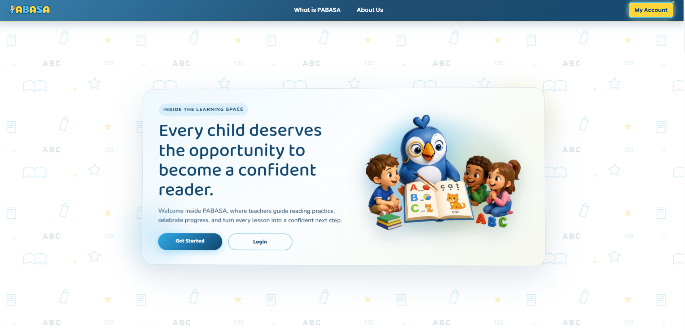

<div align="center">
  
  <h1>P.A.B.A.S.A</h1>
  <p><strong>Platform for Automated Basic Reading and Speech Assessment</strong></p>
  <p>Helping teachers guide every child toward confident reading.</p>
  <p>Reading assessment · Guided practice · Classroom management · Learner progress</p>
  <p>
    
    
    
    
    
    
    <a href="LICENSE"></a>
  </p>
  <p><a href="#overview">Overview</a> · <a href="#features">Features</a> · <a href="#quick-start">Quick start</a> · <a href="#configuration">Configuration</a> · <a href="#research-and-team">Research & team</a></p>
</div>



<p align="center"><em>Every child deserves the opportunity to become a confident reader.</em></p>

## Overview

PABASA is a web-based reading evaluation system developed for **Grade 2 students at Salawag Elementary School**, as a research project at **Technological University of the Philippines – Cavite**.

Teachers can organize classes, prepare learning materials, assess reading, and review learner progress in one place. Students take part in reading activities and guided practice, with speech recognition supporting automated assessment and feedback.

## Features

| Area | What you can do |
| --- | --- |
| Reading assessment | Record reading audio in the browser and use speech recognition to support evaluation. |
| Guided practice | Work through reading materials and activities such as syllable blending, sound detection, and story responses. |
| Classroom management | Manage classes, enrollment, courses, and assigned learning materials. |
| Learning materials | Prepare activities from uploaded documents and images, with PDF text extraction and OCR support. |
| Progress tracking | Review reading attempts, learner classifications, and progress reports. |
| CRLA reporting | Export Grade 2 Tagalog scoresheets and render workbook reports to PDF. |
| Teacher review | Review learner responses and use results to guide follow-up instruction. |

## Technology stack

PABASA uses server-rendered Django pages with JavaScript for interactive activities and browser audio recording.

| Layer | Technologies |
| --- | --- |
| Backend | Python 3.13, Django 6.0.3, Django ORM |
| Frontend | Django templates, HTML, CSS, JavaScript, Bootstrap, Bootstrap Icons |
| Charts and previews | Chart.js, PDF.js |
| Audio capture | MediaRecorder, Web Audio APIs |
| Database | SQLite |
| Speech recognition | Google Cloud Speech-to-Text |
| Documents and OCR | Tesseract, pytesseract, Pillow, pypdf, openpyxl, ReportLab, LibreOffice Calc |
| Deployment | Docker, Gunicorn, WhiteNoise |

## Quick start

Use **Python 3.13** to match the repository's Docker runtime, with `pip` and Git installed. Speech recognition, email delivery, OCR, and workbook rendering need the additional configuration below.

### 1. Clone the repository

```sh
git clone https://github.com/maeven-tapa/pabasa_workspace.git
cd pabasa_workspace
python -m venv .venv
```

Activate the virtual environment:

```powershell
# Windows PowerShell
.\.venv\Scripts\Activate.ps1
```

```sh
# macOS / Linux
source .venv/bin/activate
```

### 2. Install and initialize

```sh
python -m pip install -r requirements.txt
python pabasa_site/manage.py migrate
python pabasa_site/manage.py createsuperuser
python pabasa_site/manage.py runserver
```

### 3. Open PABASA

Open the [local homepage](http://127.0.0.1:8000/) to explore the website. The superuser account created above can access [Django administration](http://127.0.0.1:8000/admin/). Registration and other email-dependent flows require working SMTP configuration.

## Configuration

Django loads a `.env` file from the repository root. Create one for the credentials your local setup needs; keep credentials out of version control.

### Speech recognition

Configure the Google Cloud project, location, and model in `pabasa_site/pabasa_site/settings.py` for your deployment. The speech client supports a service-account file at `pabasa_site/google-stt-service-account.json`, or service-account JSON through `GOOGLE_STT_SERVICE_ACCOUNT_JSON` or `GOOGLE_STT_SERVICE_ACCOUNT_JSON_B64`.

Browser recording requires microphone permission and a secure context, such as HTTPS or localhost.

In **Audio Settings → Speech recognition**, choose **Google (activity default)**,
**Chirp 2**, **Chirp 3**, or **Knowlez STT**. The choice is saved in this browser
and applies to subsequent reading assessment and prescribed activity speech requests.
Explicit Chirp choices use Speech-to-Text V2, including Filipino recordings and
Lesson 1. Errors are reported without silently falling back to another model.
The Filipino (`fil-PH`) activity default uses Chirp 3, with no phrase hints,
boosting, or fallback to V1. Explicit model selections remain available.

Chirp 2 uses `GOOGLE_STT_CHIRP2_LOCATION` (environment variable, default
`us-central1`), separately from Chirp 3's `GOOGLE_STT_LOCATION` (`us`). Configure
a Chirp 2 region available to your project, such as `asia-southeast1`.
Chirp 2 requests word confidence and timestamps. Responses expose `stt_words`
with the original recognized word, `confidence`, `start_seconds`, and `end_seconds`.
Missing confidence is `null`. Enable **Show speech debug panel** to inspect the
returned word values. Google documents that [Chirp 2's word values are not true
confidence scores](https://docs.cloud.google.com/speech-to-text/docs/models/chirp-2).
The response marks them with `stt_word_confidence_type: provider_value_not_confidence`;
they do not change reading grades. Chirp 3 does not request word confidence.

### Optional Knowlez speech recognition

Open **Audio Settings → Speech recognition** and select **Knowlez STT**.
The selection is remembered in this browser. Select **Google (activity default)**
to restore the default Google STT route.
Read-aloud voices and prerecorded audio are unchanged. Provider errors are shown to
the learner; the app does not silently switch providers.

The service shown in the subscription documentation is Knowlez, not Microsoft's
direct Azure Speech API. Existing saved Azure selections use this corrected
integration. The existing secret name is retained for compatibility:

| Setting | Value |
| --- | --- |
| `AZURE_SPEECH_KEY` | Your **Knowlez STT API key**, stored as a Google Cloud Secret Manager secret. |

For Google Cloud Run:

1. In Google Cloud Console → **Secret Manager**, create a secret named exactly
   **`AZURE_SPEECH_KEY`** and paste your Knowlez STT API key as its value.
2. Grant the Cloud Run service account **Secret Manager Secret Accessor** on that secret.
3. Edit the Cloud Run service → **Variables & Secrets** → reference the secret as
   an environment variable named **`AZURE_SPEECH_KEY`**. Select a specific secret version.
4. Deploy the new revision. No Azure region is required. When rotating the key,
   update the secret version mapping and deploy again.

Creating the secret alone does not connect it to the app: the Cloud Run environment
variable mapping is required. For local development, set **`AZURE_SPEECH_KEY`**
in the root `.env` file (never commit the key). Credentials stay on the server.

The integration calls `https://api-stt.knowlez.com/v1/stt/transcribe` using an
`X-API-Key` header and JSON containing `audio_base64`, `filename`, and the
ISO-639-1 language hint `tl` or `en`. HTTP 201 is accepted as success. The client
validates the returned `text` string; empty or invalid results are not invented as
correct reading. Credentials are sent only from the server to Knowlez.
See the [Knowlez interactive API documentation](https://api-stt.knowlez.com/docs)
and [Cloud Run secret configuration](https://docs.cloud.google.com/run/docs/configuring/services/secrets).

Shared reading capture buffers the beginning of speech and submits after 1.8 seconds
of silence, instead of cutting off at 2.4 seconds. Silence-only and cancelled audio
are discarded. A 60-second total recording limit reports a capture error rather
than submitting a truncated clip for grading.

### Email

The current settings use Gmail SMTP on port **587** with STARTTLS. Set `EMAIL_HOST_PASSWORD` to the configured sender's Gmail App Password. To use your own sender, update `EMAIL_HOST_USER` and `DEFAULT_FROM_EMAIL` in the Django settings as well.

```dotenv
EMAIL_HOST_PASSWORD=your-gmail-app-password
```

### OCR and workbook exports

Install **Tesseract OCR** with English and Filipino language data for image text extraction. Install **LibreOffice Calc** for complete CRLA workbook-to-PDF rendering. The Dockerfile includes these native dependencies.

## Project structure

```text
pabasa_workspace/
├── pabasa_site/
│   ├── manage.py
│   ├── pabasa_site/        # Django settings, root URLs, and server entry points
│   ├── pabasa_app/         # Models, views, assessment logic, migrations, and tests
│   │   ├── static/         # CSS, JavaScript, branding, and website screenshot
│   │   └── templates/      # Application pages and components
│   └── templates/         # CRLA workbook template
├── tools/                 # Migration verification utilities
├── Dockerfile             # Python runtime and native document dependencies
├── Procfile               # Hosted application startup
├── Aptfile                # System packages for compatible build environments
├── requirements.txt
└── LICENSE
```

## Development

Run these commands from the repository root with your virtual environment active:

```sh
python pabasa_site/manage.py check
python pabasa_site/manage.py test pabasa_app
python pabasa_site/manage.py makemigrations --check --dry-run
```

The repository includes tests for assessment workflows, authorization, enrollment, guided activities, learner progress, and CRLA exports. Microphone recording and configured external services also need verification in the intended environment.

## Deployment

The Docker image installs application dependencies, collects static assets, checks that migrations have already been applied, and starts Gunicorn on port `8080` by default. Run migrations once in a deployment job before switching traffic. WhiteNoise serves static assets.

Review the Django settings before hosting: production mode is currently selected by the Cloud Run `K_SERVICE` environment variable and requires `DJANGO_SECRET_KEY`. Configure the intended hosts, credentials, HTTPS, and persistent storage for the database and uploaded files for your environment.

Cloud Run services and jobs require PostgreSQL configured through `DB_NAME`, `DB_USER`,
`DB_PASSWORD` (a Secret Manager reference), and `INSTANCE_CONNECTION_NAME` or `DB_HOST`.
Local development defaults to SQLite. See [the Cloud SQL migration guide](docs/CLOUD_SQL_MIGRATION.md)
for the backup, secret mapping, verified import, and traffic switch procedure.

## Research and team

**Research title:** Development of Guide Reading Evaluation System for Grade 2 Students in Salawag Elementary School

| Academic detail | Description |
| --- | --- |
| Institution | Technological University of the Philippines – Cavite |
| Program | BET-COET |
| Course title | Technical Research |
| Partner school | Salawag Elementary School |

Developed by:

- Leonardo Basco III
- Lady Caroline Dorongon
- Amiel John Padasay
- Dona Palacios
- Reyna Marie Santos
- Maeven Tapa

## Contributing

Bug reports and focused improvements are welcome. Include steps to reproduce an issue and screenshots where useful. For code changes, describe the expected behavior and run the relevant checks before submitting a pull request.

## Acknowledgments

Thank you to TUP Cavite, our mentors, and the teachers and students of Salawag Elementary School for their guidance and support. We also thank our families and everyone who contributed to the project and its goal of helping children read with confidence.

## License

Licensed under the [MIT License](LICENSE).
